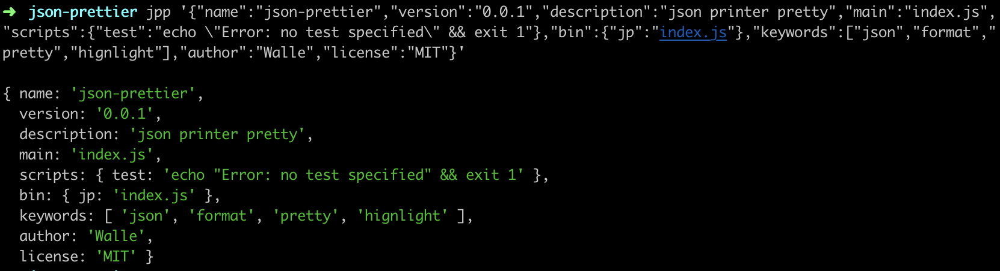

# Terminal json pretty print

### install

``` bash
npm install -g json-prettier
```
or
``` bash
yarn global add json-prettier
```

### How to use

1. format string

``` bash
jpp '{"name":"json-prettier","version":"0.0.1","description":"json printer pretty","main":"index.js","scripts":{"test":"echo \"Error: no test specified\" && exit 1"},"bin":{"jp":"index.js"},"keywords":["json","format","pretty","hignlight"],"author":"Walle","license":"MIT"}'
```

2. recevie string

``` bash
echo '{"name":"json-prettier","version":"0.0.1","description":"json printer pretty","main":"index.js","scripts":{"test":"echo \"Error: no test specified\" && exit 1"},"bin":{"jp":"index.js"},"keywords":["json","format","pretty","hignlight"],"author":"Walle","license":"MIT"}' | jpp
```

##### output



### Thanks

[https://stackoverflow.com/a/33707230](https://stackoverflow.com/a/33707230)